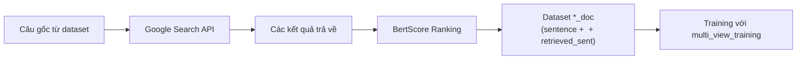
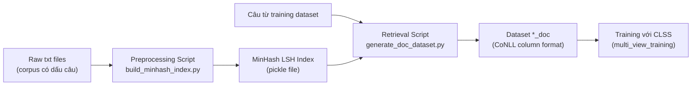

# Thay thế GoogleSearch bằng MinHashRAG + Nâng cấp & Cleanup CLSS

## Bối cảnh

Dự án **CLSS** (CLNER) dựa trên paper ACL-IJCNLP 2021: *"Improving Named Entity Recognition by External Context Retrieving and Cooperative Learning"*. Ý tưởng cốt lõi là:

1. Với mỗi câu trong tập training/dev/test, **truy vấn Google Search** để tìm các câu tương tự từ internet.
2. **Sắp xếp (ranking)** các câu truy vấn bằng BertScore.
3. Tạo dataset mới (`*_doc`) chứa các câu gốc + câu retrieved, mỗi câu retrieved được nối vào sau câu gốc phân cách bởi `<EOS>`.
4. Training dùng **cooperative learning** (multi-view training): model nhìn cả view gốc và view có external context, tối ưu KL divergence giữa 2 views.

**Vấn đề**: Google Search không phù hợp cho Sino-Nom / Classical Chinese — dữ liệu đặc thù, không có trên internet. Thay vào đó, chúng ta sẽ dùng **MinHash LSH** để retrieve câu tương tự từ **chính corpus raw** của bạn.

---

## Phân tích pipeline hiện tại

### Luồng dữ liệu hiện tại (offline, trước training)



### Các file liên quan

| File | Vai trò |
|------|---------|
| [bert_scoring.py](file:///d:/WorkSpace/CLSS/tools/bert_scoring.py) | Đọc file `en_retrieval.txt` (output Google Search), tính BertScore, rank, xuất file scored |
| [wnut17_doc_cl_kl.yaml](file:///d:/WorkSpace/CLSS/config/wnut17_doc_cl_kl.yaml) | Config dùng 2 corpus: `ColumnCorpus-WNUT` (gốc) + `ColumnCorpus-WNUTDOCFULL` (có retrieved context), bật `multi_view_training: true` |
| [finetune_trainer.py](file:///d:/WorkSpace/CLSS/flair/trainers/finetune_trainer.py#L314-L362) | Xử lý multi-view: link `sentence.orig_sent` từ DOC corpus sang source corpus |
| [sequence_tagger_model.py](file:///d:/WorkSpace/CLSS/flair/models/sequence_tagger_model.py#L1927-L2105) | `check_multi_view()` và `_calculate_multi_view_loss()` — tính KL divergence giữa 2 views |

### Cách dataset `*_doc` được cấu trúc

Dataset `*_doc_full` có format CoNLL column (text \t ner), trong đó mỗi "document" gồm:
- Câu gốc (các token + NER tag)
- Token `<EOS>` (phân cách)
- Các câu retrieved (token + tag `S-X` để đánh dấu là external)

Ví dụ:
```
-DOCSTART- O

This B-person
is O
a O
test O
<EOS> S-X
Similar S-X
sentence S-X
from S-X
retrieval S-X

-DOCSTART- O
...
```

---

## Proposed Changes: MinHash LSH RAG Pipeline

### Tổng quan kiến trúc mới



---

### Component 1: Preprocessing — Build MinHash Index

#### [NEW] [build_minhash_index.py](file:///d:/WorkSpace/CLSS/tools/build_minhash_index.py)

Script đọc tất cả file `.txt` từ thư mục raw corpus, xử lý và build MinHash LSH index.

**Chức năng:**
1. Đọc đệ quy tất cả file `.txt` trong thư mục raw corpus
2. Tách câu (dựa vào dấu câu: `。，：、；？！`)
3. Với mỗi câu, tạo **character n-gram shingles** (phù hợp cho Classical Chinese — mỗi ký tự đã là 1 đơn vị ngữ nghĩa)
4. Tạo MinHash signature cho mỗi câu
5. Lưu vào MinHash LSH index (pickle)

**Tham số chính:**
- `--raw_data_dir`: Thư mục chứa các file `.txt` raw
- `--output_index`: Đường dẫn lưu index (pickle)
- `--output_sentences`: Đường dẫn lưu danh sách câu (pickle)
- `--num_perm`: Số permutation cho MinHash (default: 128)
- `--ngram_size`: Kích thước character n-gram (default: 2 cho bigram)
- `--threshold`: Ngưỡng Jaccard similarity cho LSH (default: 0.3)
- `--min_length`: Độ dài tối thiểu của câu (default: 5 ký tự)
- `--max_length`: Độ dài tối đa của câu (default: 200 ký tự)

**Lưu ý thiết kế:**
- Dùng `datasketch.MinHash` và `datasketch.MinHashLSH`
- Cho Classical Chinese, dùng **character-level bigrams** (2-gram) thay vì word-level vì text không có khoảng trắng
- Deduplicate câu trùng lặp hoàn toàn trước khi index

---

### Component 2: Retrieval — Generate Doc Dataset

#### [NEW] [generate_doc_dataset.py](file:///d:/WorkSpace/CLSS/tools/generate_doc_dataset.py)

Script đọc dataset CoNLL column hiện có, query MinHash index, và sinh ra dataset `*_doc` mới.

**Chức năng:**
1. Đọc dataset CoNLL column format (train/dev/test files)
2. Với mỗi câu, tạo MinHash signature
3. Query LSH index để tìm top-K câu tương tự nhất
4. Rank kết quả theo Jaccard similarity thực tế
5. Loại bỏ câu quá giống (duplicate, Jaccard > 0.95) và chính nó
6. Sinh dataset mới với format: `câu gốc + <EOS> + retrieved sentences`
7. Tag các token retrieved bằng `S-X`

**Tham số chính:**
- `--input_dir`: Thư mục dataset gốc (chứa train.txt, dev.txt, test.txt)
- `--output_dir`: Thư mục xuất dataset mới
- `--index_path`: Đường dẫn MinHash LSH index
- `--sentences_path`: Đường dẫn file danh sách câu
- `--top_k`: Số câu retrieved tối đa (default: 5)
- `--column_format`: Format của dataset gốc (default: "0:text,1:ner")
- `--max_jaccard`: Loại bỏ câu có Jaccard > giá trị này (default: 0.95)
- `--min_jaccard`: Loại bỏ câu có Jaccard < giá trị này (default: 0.1)

---

### Component 3: Config cho Training

#### [NEW] [config/sino_nom_doc_cl.yaml](file:///d:/WorkSpace/CLSS/config/sino_nom_doc_cl.yaml)

Config mới cho training Sino-Nom với MinHash retrieved context. Dựa trên `wnut17_doc_cl_kl.yaml` nhưng chỉnh:
- Paths dataset trỏ đến dataset mới được generate
- `multi_view_training: true`
- `distill_posterior: true`
- Embeddings phù hợp cho Sino-Nom (e.g., bert-base-chinese hoặc model riêng)

---

### Component 4: Dataset Preprocessing Script (Optional)

#### [NEW] [tools/preprocess_raw_corpus.py](file:///d:/WorkSpace/CLSS/tools/preprocess_raw_corpus.py)

Script xử lý raw corpus để tối ưu cho MinHash retrieval.

**Chức năng:**
1. Đọc file `.txt` từ thư mục raw
2. Chuẩn hóa ký tự (unicode normalization)
3. Tách câu dựa trên dấu câu (`。，：、；？！`)
4. Loại bỏ câu quá ngắn / quá dài
5. Deduplicate (dùng exact hash)
6. Xuất ra file processed sẵn sàng cho `build_minhash_index.py`
7. Thống kê: tổng số câu, phân phối độ dài, v.v.

---

## User Review Required

> [!IMPORTANT]
> **Cấu trúc raw corpus**: Bạn đề cập raw data là "tập các file txt trong nhiều thư mục đã có dấu câu". Hãy xác nhận:
> 1. Mỗi file `.txt` chứa text liên tục hay đã tách câu (mỗi dòng 1 câu)?
> 2. Encoding là UTF-8?
> 3. Dấu câu cụ thể nào được dùng? (。，：、；？！ hay dấu Latin .,;:?!)
> 4. Có khoảng bao nhiêu file và tổng dung lượng?

> [!IMPORTANT]
> **Embedding model**: Bạn dự định dùng embedding model nào cho training? (`bert-base-chinese`, hay model Sino-Nom riêng?)

> [!WARNING]
> **Dataset NER hiện có**: Bạn đã có dataset ở format CoNLL column chưa? Hay cần tạo mới từ raw text? Config hiện tại giả sử bạn đã có dataset `{train,dev,test}.txt` ở CoNLL column format.

## Open Questions

1. **Character-level hay word-level n-grams?** Cho Classical Chinese, character bigrams thường hiệu quả nhất. Bạn có ý kiến khác không?

2. **Top-K retrieval**: Bạn muốn retrieve bao nhiêu câu cho mỗi câu gốc? Paper gốc dùng khoảng 3-5 câu. Nên bắt đầu với bao nhiêu?

3. **BertScore re-ranking**: Sau khi dùng MinHash lọc candidates, có muốn thêm bước BertScore re-ranking không? (Tốn thêm compute nhưng chính xác hơn).

4. **Ngưỡng Jaccard**: Giá trị threshold nào phù hợp? Đề xuất bắt đầu với `0.3` (khá relaxed để có nhiều candidates).

---

---

## Phase 2: Nâng cấp thư viện (Library Upgrades)

### Phân tích hiện trạng `requirements.txt`

File `requirements.txt` chứa **151 dependencies**, phần lớn cực kỳ cũ (từ 2019-2020). Nhiều thư viện không còn cần thiết hoặc cần nâng cấp.

### Các vấn đề nghiêm trọng

| Package | Hiện tại | Vấn đề | Đề xuất |
|---------|----------|--------|--------|
| `torch` | 1.3.1 | Cực cũ, không hỗ trợ GPU mới | Nâng lên ≥ 2.0 |
| `transformers` | 3.0.0 | Quá cũ, thiếu nhiều model mới | Nâng lên ≥ 4.30 |
| `pytorch-transformers` | 1.1.0 | **Deprecated** — đã merged vào `transformers` | **Xóa**, migrate sang `transformers` |
| `pytorch-pretrained-bert` | 0.6.2 | **Deprecated** — tiền thân của `transformers` | **Xóa** |
| `numpy` | 1.15.1 | Cực cũ, không tương thích PyTorch mới | Nâng lên ≥ 1.24 |
| `tensorflow` | 1.13.1 | Không dùng (chỉ 1 import bị comment) | **Xóa** |
| `allennlp` | 0.9.0 | Chỉ dùng cho ELMo (không cần cho Sino-Nom) | **Xóa** hoặc giữ optional |
| `mxnet` | 1.5.0 | Không thấy import nào | **Xóa** |
| `spacy` | 2.1.9 | Chỉ dùng trong utils (string check) | Xem xét xóa |
| `gensim` | 3.8.1 | Có thể không cần nếu không dùng Word2Vec | Xem xét xóa |
| `Flask` | 1.1.2 | Không thấy sử dụng | **Xóa** |
| `stanfordnlp` | 0.2.0 | **Deprecated** — thay bằng `stanza` | **Xóa** |

### Thêm dependencies mới

| Package | Version | Lý do |
|---------|---------|-------|
| `datasketch` | ≥ 1.6.0 | MinHash LSH cho RAG retrieval |

### Proposed Changes

#### [MODIFY] [requirements.txt](file:///d:/WorkSpace/CLSS/requirements.txt)

Tạo `requirements.txt` mới gọn nhẹ, chỉ chứa dependencies thực sự cần:

```diff
- pytorch-pretrained-bert==0.6.2
- pytorch-transformers==1.1.0
- torch==1.3.1
- transformers==3.0.0
- tensorflow==1.13.1
- tensorflow-estimator==1.13.0
- mxnet==1.5.0
- stanfordnlp==0.2.0
- Flask==1.1.2
- Flask-Cors==3.0.9
+ torch>=2.0.0
+ transformers>=4.30.0
+ datasketch>=1.6.0
```

#### [MODIFY] `pytorch_transformers` → `transformers` migration

Các file sử dụng `from pytorch_transformers import BertTokenizer`:
- [custom_data_loader.py](file:///d:/WorkSpace/CLSS/flair/custom_data_loader.py#L5)
- [embeddings.py](file:///d:/WorkSpace/CLSS/flair/embeddings.py#L17)

Đổi sang: `from transformers import BertTokenizer` (hoặc `AutoTokenizer`).

> [!WARNING]
> Migration `pytorch_transformers` → `transformers` có thể ảnh hưởng đến API. Cần test kỹ sau khi đổi.

---

## Phase 3: Cleanup Dead Code

### 3.1 Thư mục `utils/` — Bản copy cũ

Thư mục `utils/` chứa **bản copy gần như đầy đủ** của cả project:
- `utils/flair/` ≈ copy của `flair/` (datasets.py, embeddings.py, trainers/, models/, v.v.)
- `utils/train.py` ≈ copy của `train.py`
- `utils/extract_features.py` ≈ copy của `extract_features.py`
- `utils/config/` ≈ copy thêm nhiều config yaml
- `utils/tests/` ≈ copy của `tests/`

Không có file nào trong project root import từ `utils/flair/`. Thư mục `utils/` có vẻ là **bản backup/version cũ**.

#### Đề xuất

> [!CAUTION]
> Trước khi xóa, cần xác nhận với bạn rằng `utils/` không được sử dụng ở đâu.

- **Option A (An toàn)**: Giữ nguyên `utils/`, thêm vào `.gitignore`
- **Option B (Gọn)**: Di chuyển `utils/` vào `_archive/` hoặc xóa hẳn

### 3.2 File "old" và backup trong `flair/`

Các file rõ ràng là bản cũ/không dùng:

| File | Lý do xóa |
|------|----------|
| [distillation_trainer_old.py](file:///d:/WorkSpace/CLSS/flair/trainers/distillation_trainer_old.py) | Bản cũ, không import từ đâu |
| [old_kd_trainer.py](file:///d:/WorkSpace/CLSS/flair/trainers/old_kd_trainer.py) | Bản cũ, không import từ đâu |
| `.finetune_trainer.py.swp` | Vim swap file — nên xóa |
| [__init__.pyc](file:///d:/WorkSpace/CLSS/flair/__init__.pyc) nếu có | Compiled bytecode — nên trong `.gitignore` |
| `__pycache__/` directories | Nên trong `.gitignore` |

### 3.3 Xóa `import pdb` và `pdb.set_trace()` debug leftover

Có **50+ file** chứa `import pdb` và **340+ instances** `pdb.set_trace()` (cả active và commented). Đây là debug code từ development.

#### Đề xuất
- **Active `pdb.set_trace()`** (không comment): Xóa hoặc thay bằng proper logging — có ~5 active instances trong production code (`swaf_trainer.py`, `reinforcement_trainer.py`, `distillation_trainer.py`)
- **Commented `# pdb.set_trace()`**: Xóa tất cả — đây là dead code
- **`import pdb`**: Xóa nếu file không còn `pdb.set_trace()`

### 3.4 Commented-out code blocks

Nhiều file chứa các block code lớn bị comment out (ví dụ trong `sequence_tagger_model.py`, `finetune_trainer.py`, `reinforcement_trainer.py`). Đề xuất:
- Xóa các block commented code > 5 dòng liên tiếp
- Giữ lại comments giải thích/documentation

### 3.5 Cập nhật `.gitignore`

#### [NEW/MODIFY] [.gitignore](file:///d:/WorkSpace/CLSS/.gitignore)

Thêm:
```
__pycache__/
*.pyc
*.pyo
*.swp
*.swo
*.pkl
*.pt
data/
models/
logs/
outputs/
.vscode/
.idea/
```

---

## Thứ tự thực hiện (Phases)

| Phase | Nội dung | Rủi ro | Ưu tiên |
|-------|----------|--------|--------|
| **Phase 1** | MinHash RAG Pipeline (4 scripts mới) | Thấp — chỉ thêm code mới | 🔴 Cao |
| **Phase 2** | Nâng cấp thư viện | Trung bình — cần test lại | 🟡 Trung bình |
| **Phase 3** | Cleanup dead code | Thấp — chỉ xóa code không dùng | 🟢 Thấp |

> [!IMPORTANT]
> **Đề xuất**: Thực hiện Phase 1 trước (không ảnh hưởng code hiện tại). Phase 2 & 3 làm sau khi Phase 1 đã verified hoạt động.

---

## Verification Plan

### Automated Tests

1. **Unit test cho MinHash indexing:**
   ```bash
   python tools/build_minhash_index.py --raw_data_dir data/raw_sample --output_index data/test_index.pkl --output_sentences data/test_sents.pkl
   ```
   - Kiểm tra index được tạo thành công
   - Kiểm tra query trả về kết quả hợp lý

2. **Unit test cho dataset generation:**
   ```bash
   python tools/generate_doc_dataset.py --input_dir data/sample --output_dir data/sample_doc --index_path data/test_index.pkl --sentences_path data/test_sents.pkl
   ```
   - Kiểm tra output có format CoNLL column đúng
   - Kiểm tra `<EOS>` separator và tag `S-X` đúng vị trí

3. **Dry run training:**
   ```bash
   python train.py --config config/sino_nom_doc_cl.yaml
   ```
   - Kiểm tra model load data thành công
   - Kiểm tra multi-view training hoạt động (loss có 2 thành phần)

### Manual Verification

- Xem sample output của retrieval: câu retrieved có thực sự tương tự câu gốc không?
- So sánh Jaccard scores: phân phối hợp lý hay quá cao/thấp?
- Kiểm tra thống kê: mỗi câu trung bình retrieve được bao nhiêu câu?
